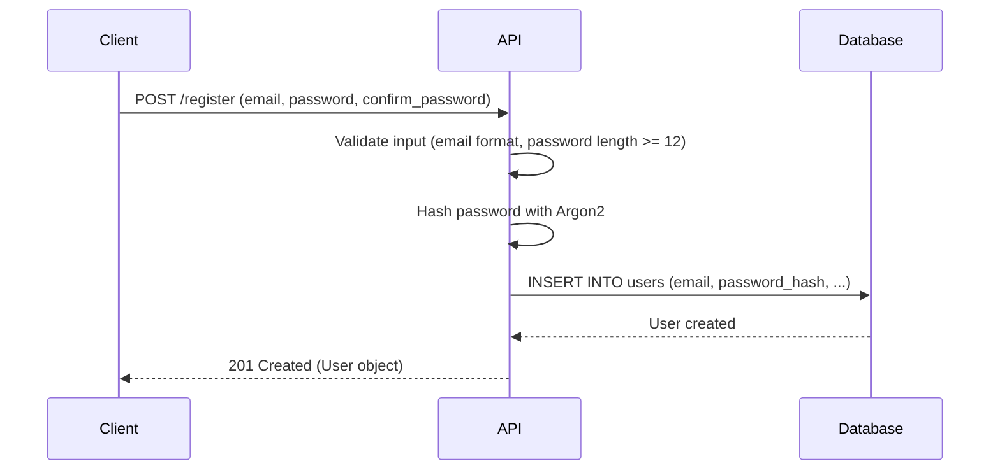
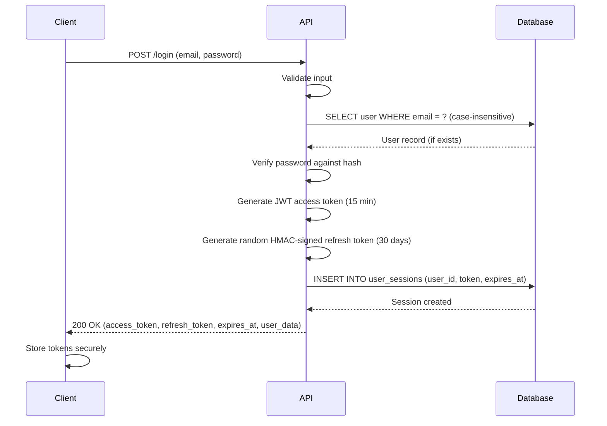
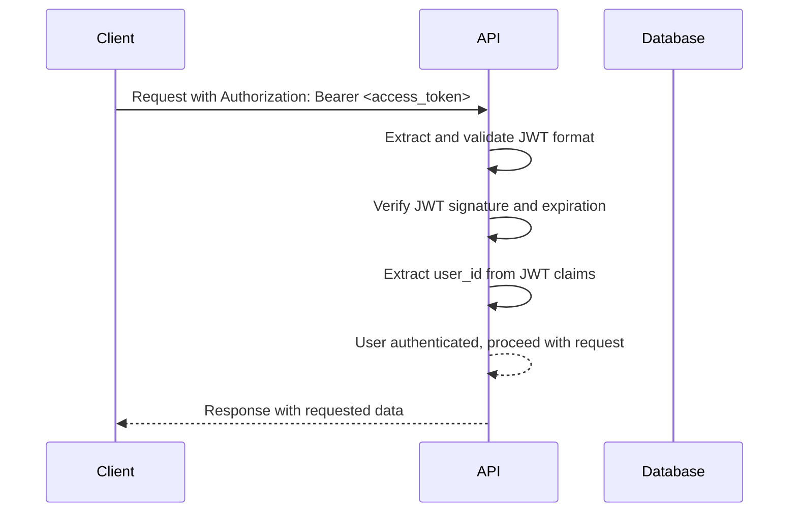
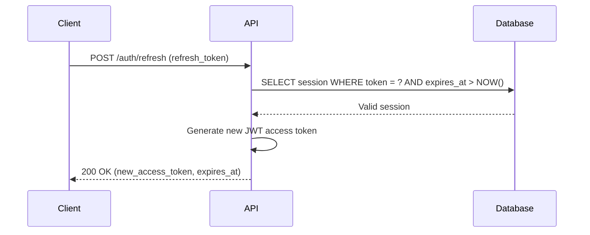
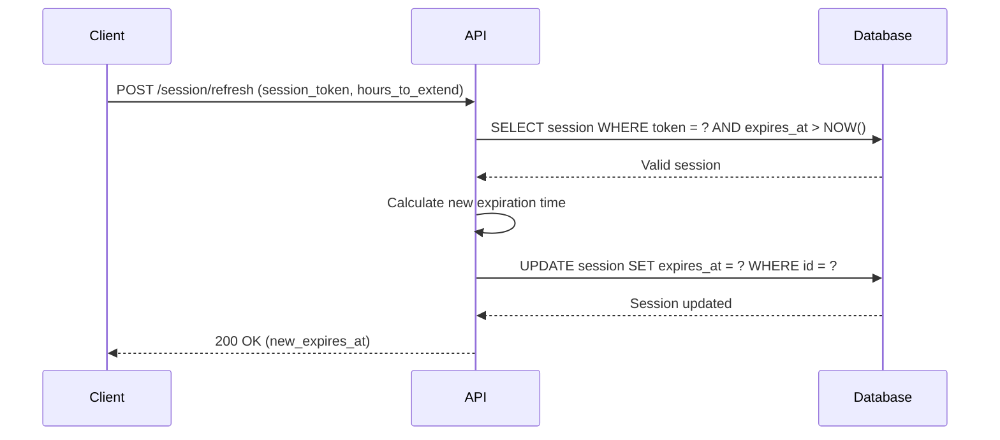
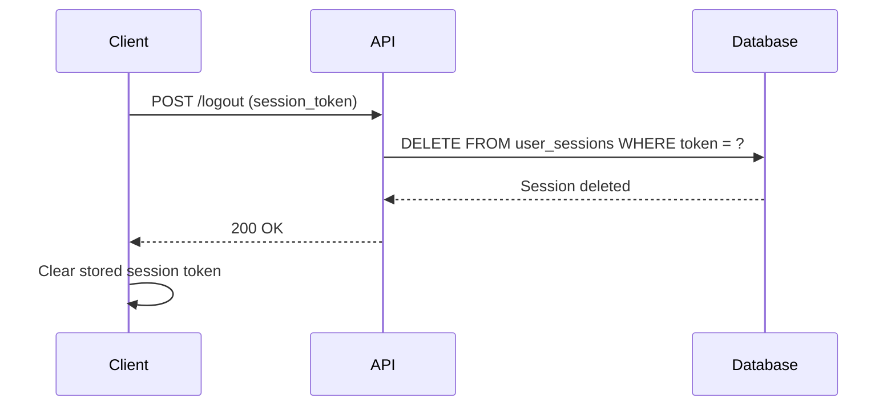
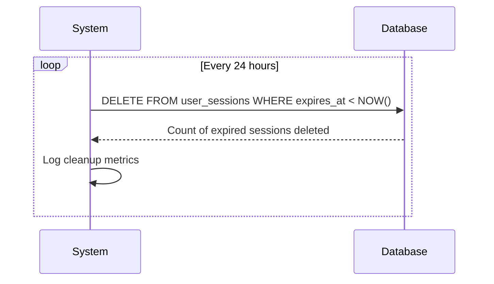

← [Back to Index](./README.md) | **API Reference**: [REST API Guide](./REST_API_GUIDE.md#authentication)

# Authentication & Security

Dual-token authentication system with JWT access tokens (short-lived, 15 minutes) and session refresh tokens (long-lived, 30 days), Argon2 password hashing, and configurable expiration periods.

## Authentication Flow

### User Registration Flow


### User Login Flow


### Session Validation Flow (JWT Access Token)


### JWT Access Token Refresh Flow


### Session Refresh Flow


### Logout Flow


### Session Cleanup Flow (Automated)


## Core API

### User Authentication
```rust
// User registration (minimum 12 character password, email validation)
pub async fn register_user(conn: &mut DbConn, register_user: RegisterUser) -> Result<User>

// User authentication and session creation
pub async fn login_user(conn: &mut DbConn, login_user: LoginUser) -> Result<LoginResult>

// Session validation and user retrieval
pub async fn validate_session(conn: &mut DbConn, session_token: &str) -> Result<User>

// Session termination
pub async fn logout_user(conn: &mut DbConn, session_token: &str) -> Result<()>

// Session extension
pub async fn refresh_session(conn: &mut DbConn, session_token: &str, hours_to_extend: i64) -> Result<String>

// JWT access token refresh
pub async fn refresh_access_token(conn: &mut DbConn, refresh_token: &str) -> Result<RefreshTokenResult>
```

### Session Management
```rust
// Advanced session operations
pub async fn cleanup_expired_sessions(conn: &mut DbConn) -> Result<u64>
pub async fn revoke_all_user_sessions(conn: &mut DbConn, user_id: Uuid) -> Result<u64>
pub async fn get_user_active_sessions(conn: &mut DbConn, user_id: Uuid) -> Result<Vec<UserSession>>
pub async fn revoke_session_by_token(conn: &mut DbConn, session_token: &str) -> Result<()>
pub async fn extend_all_user_sessions(conn: &mut DbConn, user_id: Uuid, hours_to_extend: i64) -> Result<u64>
```

### Password Utilities
```rust
pub fn generate_password_hash(password: &str) -> Result<String>
pub fn verify_password(password: &str, hash: &str) -> Result<bool>
pub fn generate_session_token() -> Result<String>
```

## Data Models

### Core Authentication Models
```rust
pub struct LoginUser {
    pub email: String,     // Case-insensitive lookup
    pub password: String,  // Plain text verification
}

pub struct LoginResult {
    pub user: User,                        // Authenticated user
    pub access_token: String,              // JWT access token (15 minutes)
    pub refresh_token: String,             // Session token (30 days)
    pub access_token_expires_at: DateTime<Utc>,  // JWT expiration
    pub refresh_token_expires_at: DateTime<Utc>,  // Session expiration
}

pub struct RefreshTokenResult {
    pub access_token: String,                      // New JWT access token
    pub refresh_token: Option<String>,             // New refresh token (rotated), None if within grace period
    pub expires_at: DateTime<Utc>,                 // When the new access token expires
}

pub struct UserSession {
    pub id: Uuid,                    // Session primary key
    pub user_id: Uuid,               // Session owner
    pub token: String,               // Random HMAC-signed token (refresh token)
    pub expires_at: DateTime<Utc>,   // Expiration time
    pub created_at: DateTime<Utc>,   // Creation time
    pub updated_at: DateTime<Utc>,   // Last update
}
```

## Security Features

### JWT Access Token Security
- **Short-Lived Tokens**: 15-minute expiration reduces window for token misuse
- **Bearer Token Authentication**: Standard RFC 6750 compliant format
- **Signature Verification**: HMAC-SHA256 signing prevents token tampering
- **No Database Lookup**: JWT validation is stateless and fast
- **Automatic Expiration**: Tokens expire quickly, forcing regular refresh

### Session Refresh Token Security
- **Random Tokens**: 256-bit cryptographic randomness
- **Long-Lived Tokens**: 30-day expiration for user convenience
- **SHA-256 Hashing**: Tokens hashed before database storage for security
- **Database Storage**: Revocable token hashes stored in database (plaintext tokens never stored)
- **Integrity Verification**: SHA-256 one-way hashing prevents token exposure in database backups
- **Constant-Time Comparison**: Prevents timing attacks on token verification
- **Configurable Expiration**: Default session duration with automatic cleanup
- **Case-Insensitive Email**: User-friendly login experience
- **Multi-Device Support**: Users can maintain concurrent sessions
- **Session Revocation**: Immediate token invalidation on logout

## Validation Rules

| Input | Requirement | Error Message |
|--------|-------------|---------------|
| Email | Required, valid format | "Email cannot be empty" / "Invalid email format" |
| Password | Minimum 12 characters, patterns | "Password must be at least 12 characters long" |
| Session Token | Required, non-empty | "Session token cannot be empty" |
| Login | Valid credentials | "Invalid email or password" |
| Session | Non-expired token | "Invalid or expired session token" |

## Error Types

```rust
Authentication(String)     // Invalid credentials
InvalidToken(String)      // Invalid/expired tokens
SessionExpired(String)     // Session expiration
Validation(String)        // Input validation errors
```

## Database Schema

```sql
CREATE TABLE user_sessions (
    id UUID PRIMARY KEY DEFAULT uuidv7(),
    user_id UUID NOT NULL REFERENCES users(id) ON DELETE CASCADE,
    token TEXT UNIQUE NOT NULL,
    expires_at TIMESTAMPTZ NOT NULL,
    created_at TIMESTAMPTZ NOT NULL DEFAULT NOW(),
    updated_at TIMESTAMPTZ NOT NULL DEFAULT NOW()
);

-- Performance indexes
CREATE INDEX idx_user_sessions_user_id ON user_sessions(user_id);
CREATE INDEX idx_user_sessions_token ON user_sessions(token);
CREATE INDEX idx_user_sessions_expires_at ON user_sessions(expires_at);
```

## Usage Examples

### Basic Authentication with JWT
```rust
// Login and get both tokens
let login_result = login_user(&mut conn, LoginUser {
    email: "user@example.com".to_string(),
    password: "SecurePass123!".to_string(),
}).await?;

// Use JWT access token for API requests (in Authorization header)
// Authorization: Bearer <login_result.access_token>

// When access token expires, refresh it using refresh token
let new_token_result = refresh_access_token(&mut conn, &login_result.refresh_token).await?;

// Logout (invalidates refresh token)
logout_user(&mut conn, &login_result.refresh_token).await?;
```

### Session Management
```rust
// Get active sessions
let sessions = get_user_active_sessions(&mut conn, user.id).await?;

// Extend all sessions by default duration
let extended = extend_all_user_sessions(&mut conn, user.id, 168).await?;

// Force logout from all devices
let revoked = revoke_all_user_sessions(&mut conn, user.id).await?;

// Cleanup expired sessions
let cleaned = cleanup_expired_sessions(&mut conn).await?;
```

## Cookie-Based Authentication

For web browser clients, tokens can be stored in cookies for seamless authentication without manual header management.

### Token Storage Options

**Access Token (JWT, 15 minutes)**:
- Authorization header: `Authorization: Bearer <token>` (mobile apps, SPAs)
- Cookie: `access_token=<token>` (traditional web apps)

**Refresh Token (HMAC-signed, 30 days)**:
- Request body: POST /auth/refresh with token (API clients)
- Cookie: `refresh_token=<token>` (automatic browser sending)

### Multi-Source Token Extraction

The authentication system supports both headers and cookies with priority:

```rust
use backend::services::jwt::authenticate_jwt_token_from_anywhere;

// Works for both API and browser clients
let user_id = authenticate_jwt_token_from_anywhere(
    auth_header,           // Priority 1: Authorization header
    cookie_value,          // Priority 2: Cookie fallback
    &secret,
)?;
```

**Priority Order**:
1. Authorization header (API/mobile clients take precedence)
2. Cookie (browser clients fallback)

### Cookie Security

All cookies include security flags:

```rust
pub struct CookieConfig {
    pub http_only: bool,        // true - Prevents JavaScript access (XSS protection)
    pub secure: bool,           // true - HTTPS only (production)
    pub same_site: SameSite,    // Lax (default) - CSRF protection while allowing external links
    pub path: String,           // "/" - Apply to all paths
    pub domain: Option<String>,  // Optional - e.g., ".example.com"
}
```

**SameSite=Lax** (default): Allows users to click links from emails, Slack, or OAuth redirects while blocking CSRF attacks from embedded content (forms, AJAX, images).

**Example Cookie Header**:
```http
Set-Cookie: access_token=eyJhbGc...; HttpOnly; Secure; SameSite=Lax; Path=/; Max-Age=900
Set-Cookie: refresh_token=a1b2c3...; HttpOnly; Secure; SameSite=Lax; Path=/; Max-Age=2592000
```

### Cookie Utilities

**Extract tokens**:
```rust
use backend::services::cookies::{
    extract_jwt_token,
    extract_refresh_token,
};

// Extract access token from header or cookie
let token = extract_jwt_token(
    Some("Bearer eyJhbGc..."),
    Some("cookie_value"),
)?;

// Extract refresh token from cookie
let refresh_token = extract_refresh_token(
    Some("cookie_value")
)?;
```

**Build cookies**:
```rust
use backend::services::cookies::{
    build_access_token_cookie,
    build_refresh_token_cookie,
    build_clear_token_cookie,
    CookieConfig,
};

let config = CookieConfig::default();

// Build Set-Cookie header for access token
let access_cookie = build_access_token_cookie(&token, &config);

// Build Set-Cookie header for refresh token
let refresh_cookie = build_refresh_token_cookie(&refresh_token, &config);

// Build cookie to clear token (logout)
let clear_cookie = build_clear_token_cookie("access_token");
```

### Login Flow with Cookies

For browser clients, the login endpoint sets cookies automatically:

```http
POST /login HTTP/1.1
Content-Type: application/json

{
  "email": "user@example.com",
  "password": "SecurePass123!"
}

---

HTTP/1.1 200 OK
Set-Cookie: access_token=eyJhbGc...; HttpOnly; Secure; SameSite=Lax; Path=/; Max-Age=900
Set-Cookie: refresh_token=a1b2c3...; HttpOnly; Secure; SameSite=Lax; Path=/; Max-Age=2592000
Content-Type: application/json

{
  "user": {...},
  "access_token": "eyJhbGc...",
  "refresh_token": "a1b2c3...",
  "access_token_expires_at": "2025-01-06T10:30:00Z",
  "refresh_token_expires_at": "2025-02-05T10:00:00Z"
}
```

**Browser automatically includes cookies** in subsequent requests:
```http
GET /api/workspaces HTTP/1.1
Cookie: access_token=eyJhbGc...; refresh_token=a1b2c3...
```

### Logout Flow with Cookies

Logout clears cookies by setting Max-Age=0:

```http
POST /logout HTTP/1.1

---

HTTP/1.1 200 OK
Set-Cookie: access_token=; HttpOnly; SameSite=Lax; Path=/; Max-Age=0
Set-Cookie: refresh_token=; HttpOnly; SameSite=Lax; Path=/; Max-Age=0
```

### Configuration

Cookie settings are configured in `src/config.rs`:

```rust
pub struct Config {
    pub database: DatabaseConfig,
    pub sessions: SessionsConfig,
    pub jwt: JwtConfig,
    pub cookies: CookieConfig,  // NEW
}
```

**Default CookieConfig**:
```rust
CookieConfig {
    access_token_name: "access_token",
    refresh_token_name: "refresh_token",
    http_only: true,           // XSS protection
    secure: false,              // Set to true in production
    same_site: SameSite::Lax,   // CSRF protection + allows email/OAuth links
    path: "/",
    domain: None,
}
```

**Environment Configuration** (future):
```bash
# Cookie settings (when env support is added)
BUILDSCALE__COOKIES__SECURE=true
BUILDSCALE__COOKIES__SAME_SITE=Strict
BUILDSCALE__COOKIES__DOMAIN=.example.com
```

## Related Documentation

- **[Architecture Overview](./ARCHITECTURE.md)** - System design and database schema
- **[User & Workspace Management](./USER_WORKSPACE_MANAGEMENT.md)** - User registration and management APIs
- **[Role Management](./ROLE_MANAGEMENT.md)** - RBAC system and permissions
- **[API Guide](./API_GUIDE.md)** - Complete API reference with error handling
- **[Installation Guide](./README.md#installation--setup)** - Development setup and troubleshooting

## For Developers

### Finding Current Configuration Values
```bash
# Check password length requirements (central utility in src/validation.rs)
grep -n "password.len() < 12" src/validation.rs

# Check session extension limits
grep -n "Cannot extend session by more than" src/services/users.rs

# Check session management functions
grep -n "pub async fn.*session" src/services/sessions.rs

# View session table structure
psql -d buildscale -c "\d user_sessions"

# Check workspace name validation
grep -n "validate_workspace_name" src/validation.rs
```

### Session Management Configuration
Session management settings are typically found in:
- `src/validation.rs`: Password validation requirements (12+ characters)
- `src/services/sessions.rs`: Session cleanup and management
- `src/services/users.rs`: Authentication logic

### Security Configuration
- **Token Generation**: Random HMAC-signed tokens generated in `src/services/refresh_tokens.rs`
- **Password Hashing**: Argon2 configuration in password utility functions
- **Session Validation**: Token format and HMAC signature verification

### Changing Security Settings
1. Update constants in appropriate source files
2. Update database schema if needed (migrations/)
3. Add tests for new security settings
4. Update CONFIGURATION.md with new values
5. Update API documentation if interfaces change

### Current Security Defaults
See [CONFIGURATION.md](./CONFIGURATION.md) for current security-related configuration values, including session durations, password requirements, and token settings.
